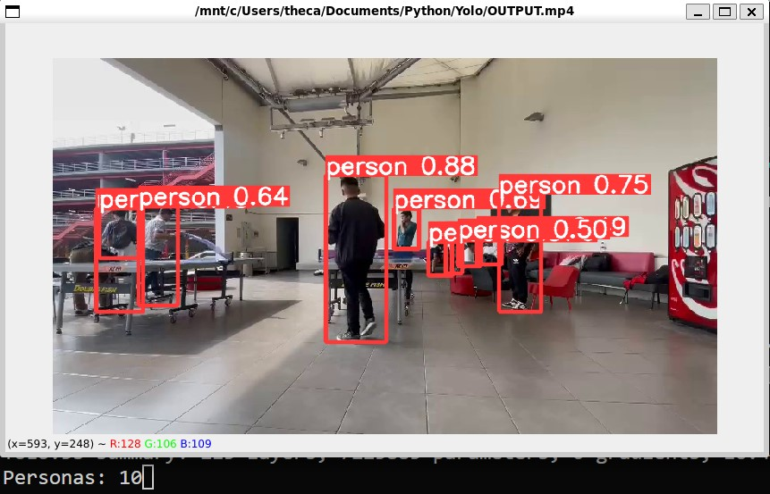

### Integrantes:
- Carlos Alonso Castilla Ochoa (u202116277)
- Jak Cristian Campos Espinoza (u20211a184)

- Video grabado en el break
- Se utiliza el proyecto YoloV5 (https://github.com/ultralytics/yolov5)
- El proyecto requiere python 3.10

El algoritmo YoloV5 detecta las personas que aparecen en el video. Nuestro proyecto utiliza una modificación del script detect.py para mostrar la cantidad de personas en cada frame en la consola:

